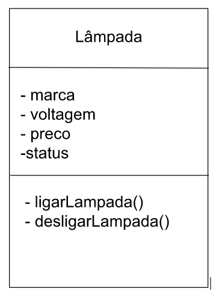
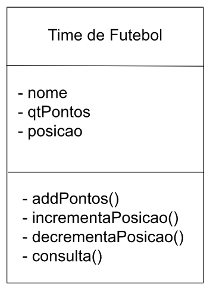

<h1>Atividade Compartilhada 6.03 Batista & Moraes</h1>
<h2>1. Escreva um modelo para representar uma lâmpada que está à venda em um supermercado. Que dados devem ser representados por esse modelo?</h2>
<p>Os dados que devem representar uma lâmpada vendida no mercado são: Marca, voltagem e o preço. Os métodos que devem conter uma classe do tipo lâmpada são as responsáveis por ligar e desligar a lâmpada.</p>


<h2>2. Crie um modelo para representar um time de um esporte qualquer em um campeonato desse esporte. Que dados e operações esse modelo deve ter?</h2>
<p>Os dados que devem representar um time de futebol, por exemplo, em um campeonato são: Nome, qt. de Pontos e a posição no campeonato. Os métodos que devem conter uma classe do tipo time de futebol são as responsáveis por somar pontos, incrementar ou diminuir a posição na tabela e consultar as informações do time.</p>


<h2>6. Modifique o método “abreContaSimples” da classe “ContaBancariaSimplificada” de forma que o cliente só possa abrir uma conta com um valor mínimo de R$ 100,00</h2>

```java
public void abreContaSimples(String nome, double valorInicialConta){
    const double valorMinimo = 100.00;

    nomeDoCorrentista = nome;
    saldo = 0.00;
    contaÉEspecial = false;

    if(valorInicialConta < 100){
        System.out.println("Você está tentando criar uma conta com um valor abaixo do mínimo que é de R$" + valorMinimo + ". Tente novamente com um valor correto!");
    }
}
```

<h2>7. Identifique e explique o(s) erro(s) na classe abaixo:
1 class Registro De Eleitor
2 {
3 /**
4 * Declaração dos campos desta classe
5 */
6 int tituloDeEleitor; // número do título do eleitor
7 String nome; // nome do eleitor
8 short zonaEleitoral; // número da zona eleitoral
9 } // fim da classe</h2>
<p>O Erro principal deste código é que a classe foi nomeada de forma incorreta. para nomeação de classe é preciso que apenas um nome seja indicado. A forma correta de se utilizar, uma boa prática é utilizar o sistema de camelCase. Corrigindo: RegistroDeEleitor;</p>


